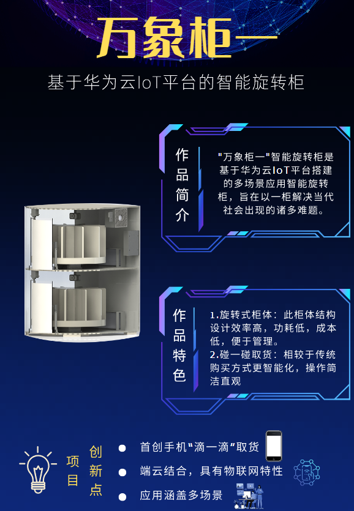
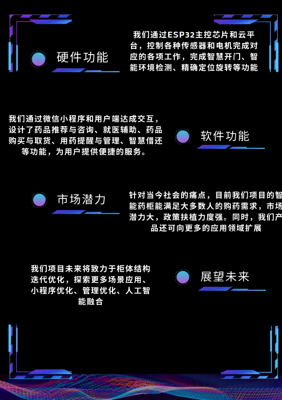
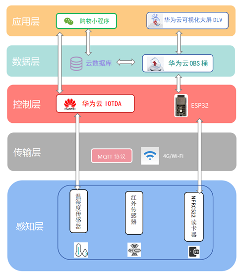

# 📦 万物柜一：楼下自助的智能旋转药柜

万物柜一是一款专为医药设计的**无人值守共享智能药柜系统**，通过手机端小程序完成租用、管理与支付流程，提升大小社区内获得药品的效率，为了解决医院，药店排队时间过长、城市交通拥堵、药店无法24h购药以及老年人和偏远地区居民的用药困扰，本项目提供了一种创新的解决方案，，购药系统通过智能药柜应用和技术的结合，为用户带来便捷、高效的用药体验，实现医疗健康和用药服务的全面升级。借还系统为企业和机构带来更加便捷、高效和智能化的借还管理体验。

---

## 🚀 核心功能

- 📱 **小程序界面交互**：碰一碰开柜、下单租用、一键归还、费用结算
- 🧠 **智能调度系统**：实时监测各柜使用情况，实现空间资源最优分配
- 🔐 **安全保障机制**：柜门自动锁闭，异常状态上传后台，支持碰一碰开启

---

## 🧩 设计亮点

- 首创“滴一滴”取货功能，操作简洁直观
- 多设备协同控制：支持主柜、副柜无线联动
- 模块化硬件架构：便于不同规模部署
- 云端后台管理平台：查看订单、维护状态、营收报表一站式完成
- 低功耗待机 + 高频响应机制：兼顾成本与性能

---

## 🔧 技术实现概览

- 前端：微信小程序 + Web 后台管理界面
- 后端：Spring Boot + MySQL + Redis 缓存
- 通讯协议：MQTT 与蓝牙结合实现设备控制与状态同步
- 硬件：STM32主控 + 电磁锁 + 4G模组

---

## 🌐 应用场景

- 💊 楼下快速购药  
- 📦 快递临时寄存
- 🎒 图书馆/自习室临时存包
- 🎮 赛事/活动临时装备存放
- 🛍️ 校园内外自助物品交接

---

## 📝 报告说明

项目完整设计方案、UI界面、系统架构图及调研结果已收录于报告文档：  
📄 `万物柜一文档最终稿.docx`

## 🖼️ 项目展示图

  
  

## 🧩 系统架构图

1、	感知层
a)	采用非接触式射频读卡
b)	传感器将物理信号转换为数字信号
2、	传输层
a)	SPI协议传输数据
b)	芯片通过WiFi以MQTT协议与华为云互通
c)	小程序以HTTP2协议控制华为云
3、	控制层
a)	ESP32作为主控芯片控制外设
b)	华为云下发命令控制ESP32

